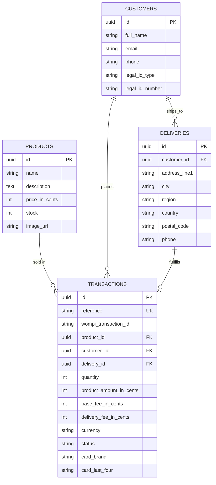

# Checkout App

A single-product checkout SPA + API: pick a product, pay by credit card through Wompi (sandbox), and see stock update live. Built as a fullstack take-home exercise covering hexagonal architecture, Railway-Oriented Programming, a Flux-style frontend, and IaC.

> **Before you push this to GitHub:** name the repository and its description generically (e.g. `checkout-app`, `card-payment-demo`) — avoid the payment provider's name in the repo itself, per the test's anti-fraud instructions. This document still refers to it by name where that's the only honest way to describe the integration.

## Business flow

```
1. Product page  →  2. Card + delivery details  →  3. Order summary  →  4. Final status  →  5. Product page (stock updated)
```

On "Pay": the backend creates a **PENDING** transaction, the card is tokenized and charged through Wompi, and once a terminal status comes back the backend atomically settles the transaction and decrements stock (only on `APPROVED`).

## Repo layout

```
backend/    NestJS API — hexagonal architecture + Railway-Oriented Programming
frontend/   React + Redux Toolkit SPA (Vite, Jest)
infra/cdk/  AWS CDK app (prepared; not deployed from this environment)
docker-compose.yml   Postgres + backend + frontend, for local/demo use
```

## Architecture

**Backend** (`backend/src`) is organized per bounded context (`products`, `customers`, `deliveries`, `transactions`), each with:

- `domain/` — framework-free entities owning their invariants (e.g. `Product.decrementStock`, `Transaction.settle` refusing to double-settle)
- `application/` — use cases + **ports** (repository/gateway interfaces)
- `infrastructure/adapters/in/http` — Nest controllers & DTOs
- `infrastructure/adapters/out/persistence` — TypeORM repositories implementing the ports
- `infrastructure/adapters/out/wompi` — the only file that speaks Wompi's HTTP contract

Use cases return `Result<T, DomainError>` (`shared/domain/result.ts`) and are composed with a `chain()` helper, so a use case like `CreateTransactionUseCase` reads as a straight pipeline (`validate → loadProduct → checkStock → persistCustomer → persistDelivery → persistTransaction`) that short-circuits on the first failure — Railway-Oriented Programming without throwing for expected business failures. A single `unwrapOrThrow` adapter maps `DomainError` codes to HTTP status codes at the controller boundary.

**Sensitive data**: the raw card number/CVC **never reach the backend**. The frontend tokenizes the card directly against Wompi's public API (public key only); only the resulting token + non-sensitive metadata (brand, last four) are sent to our backend. The backend's private key and integrity secret exist only server-side, used to call Wompi and to compute the integrity `signature` (`SHA256(reference + amount_in_cents + currency + integritySecret)`).

**Frontend** (`frontend/src`) is a Redux Toolkit ("Flux") app:

- `features/products`, `features/checkout`, `features/config` — slices; `checkout` is persisted to `localStorage` (customer/delivery/transaction — never raw card data) so a refresh mid-checkout resumes where the user left off. If a refresh happens to land on the summary step (card data only ever lives in local component state), the UI gracefully sends the user back one step to re-enter the card rather than showing a broken screen.
- `api/checkoutApi.ts` — calls our backend; `api/wompiApi.ts` — calls Wompi directly for the acceptance tokens and card tokenization
- `pages/ProductPage` → `components/PaymentModal` (`DetailsForm`) → `components/SummaryBackdrop` → `pages/ResultPage`

## Data model



Stock is decremented inside a single DB transaction with a `SELECT ... FOR UPDATE` row lock on the product, so two concurrent buyers can't oversell the last unit.

## Tech stack

| Layer | Choice |
|---|---|
| Frontend | React + TypeScript, Redux Toolkit, React Router, Vite, plain CSS (flexbox/grid, mobile-first) |
| Backend | NestJS + TypeScript, TypeORM + PostgreSQL, class-validator, Swagger |
| Testing | Jest on both sides (`@testing-library/react` for the frontend) |
| Infra | Docker + docker-compose (local), AWS CDK — RDS/App Runner/S3+CloudFront (prepared) |

## Getting started

### Option A — Docker Compose (fastest way to see it working)

```bash
cp .env.example .env               # fill in your Wompi sandbox keys
docker compose up --build
# seed dummy products (first run only)
cd backend && DB_HOST=localhost npm run seed
```

Frontend: http://localhost:5173 · API: http://localhost:3000/api · Swagger: http://localhost:3000/api/docs

### Option B — Run each app locally

```bash
# Postgres (or point at your own instance)
docker run -d -p 5432:5432 -e POSTGRES_PASSWORD=postgres -e POSTGRES_DB=checkout postgres:16-alpine

cd backend
cp .env.example .env               # fill in Wompi sandbox keys
npm install
npm run seed
npm run start:dev                  # http://localhost:3000

cd ../frontend
cp .env.example .env
npm install
npm run dev                        # http://localhost:5173
```

## Environment variables

**`backend/.env`**

| Var | Purpose |
|---|---|
| `PORT`, `CORS_ORIGIN` | HTTP server + allowed frontend origin |
| `DB_HOST`, `DB_PORT`, `DB_USERNAME`, `DB_PASSWORD`, `DB_NAME` | Postgres connection |
| `BASE_FEE_IN_CENTS`, `DELIVERY_FEE_IN_CENTS`, `CURRENCY` | Checkout fee constants |
| `WOMPI_API_URL` | Wompi environment base URL (sandbox/UAT by default) |
| `WOMPI_PRIVATE_KEY`, `WOMPI_INTEGRITY_SECRET` | **Server-side only**, never sent to the frontend |
| `WOMPI_POLL_ATTEMPTS`, `WOMPI_POLL_DELAY_MS` | How long to poll Wompi for a terminal transaction status |

**`frontend/.env`**

| Var | Purpose |
|---|---|
| `VITE_API_URL` | Our backend's base URL |
| `VITE_WOMPI_PUBLIC_KEY` | Public key — safe client-side, used to tokenize cards directly with Wompi |
| `VITE_WOMPI_API_URL` | Wompi environment base URL |

## API documentation

- **Swagger UI**: `/api/docs` on the running backend (e.g. http://localhost:3000/api/docs)
- **Postman collection**: [`backend/postman/checkout-api.postman_collection.json`](backend/postman/checkout-api.postman_collection.json) — import it and set the `baseUrl` variable

Core endpoints: `GET /products`, `GET /products/:id`, `GET /config/fees`, `POST /transactions`, `POST /transactions/:id/confirm`, `GET /transactions/:id`, `GET /customers/:id`, `GET /deliveries/:id`, `GET /health`.

## Testing & coverage

```bash
cd backend && npm run test:cov
cd frontend && npm run test:cov
```

Both suites enforce an 80% coverage threshold (`coverageThreshold` in each `jest` config) and are green:

| | Suites | Tests | Stmts | Branch | Funcs | Lines |
|---|---|---|---|---|---|---|
| Backend | 26 | 100 | 99.66% | 86.02% | 98.5% | 99.63% |
| Frontend | 17 | 83 | 98.88% | 96.39% | 95.5% | 98.81% |

The full payment flow (product page → card/delivery form → summary → pay → result, with stock decrementing) was also exercised end-to-end in a real browser against Wompi's sandbox, both via `npm run dev` and via the Docker images — no console errors. This covered both outcomes (`4242 4242 4242 4242` → APPROVED, `4111 1111 1111 1111` → DECLINED with stock correctly untouched), the out-of-stock disabled state, and refresh-resilience on both the details/summary step and the result page. Every interactive button was also checked for sufficient contrast in its resting (non-hover) state at both a 375px and a 1440px viewport, after an earlier CSS specificity bug slipped past hover-masked automated screenshots.

## Security notes (OWASP alignment)

- Raw card data (PAN/CVC) never touches the backend or any log — tokenization happens client-side against Wompi.
- `helmet()` + explicit security headers (also set at the nginx layer for the built frontend), CORS restricted to the configured frontend origin, and `@nestjs/throttler` rate-limiting on the transaction endpoints.
- All input validated with `class-validator` at the HTTP boundary and re-validated as business rules in the domain/use-case layer (stock availability, transaction state transitions).
- Wompi's `signature` (integrity hash) is computed server-side only, using a secret that's never shipped to the client.
- The CDK stack encrypts the RDS instance at rest, keeps it in an isolated subnet with no public accessibility, and stores DB credentials + the Wompi private key/integrity secret in Secrets Manager rather than plaintext env vars.

## Deployment

This environment had no AWS credentials, so the CDK app was **written and `cdk synth`-verified, but not deployed**. To actually deploy:

```bash
cd infra/cdk
npm install
npx cdk bootstrap                  # once per account/region
npx cdk deploy Checkout-NetworkDb Checkout-Backend Checkout-Frontend

# push the backend image to the ECR repo the stack created
aws ecr get-login-password | docker login --username AWS --password-stdin <account>.dkr.ecr.<region>.amazonaws.com
docker build -t <ecr-repo-uri>:latest ./backend
docker push <ecr-repo-uri>:latest

# fill in the real Wompi keys (the stack deploys a placeholder secret)
aws secretsmanager put-secret-value --secret-id <WompiSecret arn> \
  --secret-string '{"privateKey":"prv_...","integritySecret":"..."}'

# build and upload the frontend, pointed at the deployed backend's App Runner URL
cd ../../frontend
VITE_API_URL=https://<app-runner-url>/api VITE_WOMPI_PUBLIC_KEY=pub_... npm run build
aws s3 sync dist/ s3://<frontend-bucket-name>
```

Stacks: `Checkout-NetworkDb` (VPC, no NAT gateway + single-AZ encrypted Postgres), `Checkout-Backend` (ECR + App Runner over a VPC connector), `Checkout-Frontend` (private S3 + CloudFront with SPA fallback routing).

## Known trade-offs

- If `confirmPayment` fails after `createTransaction` already succeeded, retrying from the frontend creates a second PENDING transaction rather than reusing the first — acceptable for this exercise's scope, but a real system would make confirmation idempotent per transaction id.
- The VPC has no NAT gateway to stay in the free tier; the backend's calls to Wompi go over App Runner's default public networking path (not the VPC connector, which is only used for the private RDS connection).
- `synchronize: true` is used for the ORM schema instead of migrations, appropriate for this exercise's scope but not for a real production rollout.
