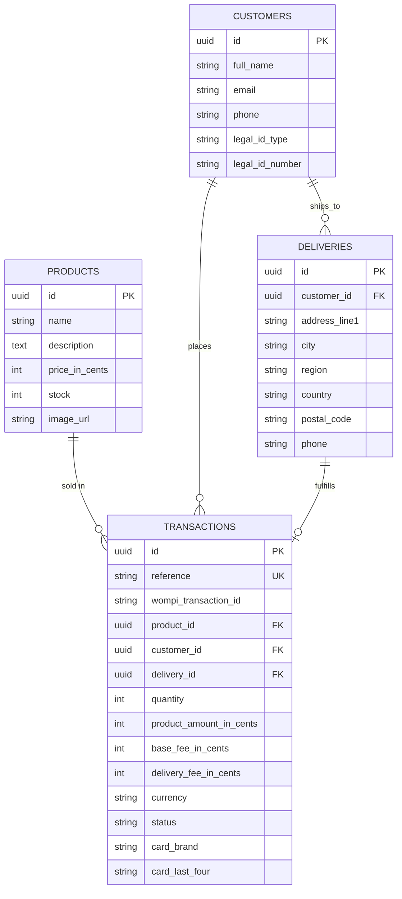

# Checkout App

Single-product checkout SPA + API. Pick a product, pay by credit card through Wompi (sandbox), stock updates live.

> Naming note: don't put the payment provider's name in the actual GitHub repo (name/description) per the test's instructions. This doc still calls it by name since there's no honest way to describe the integration otherwise.

## Business flow

```
1. Product page -> 2. Card + delivery details -> 3. Order summary -> 4. Final status -> 5. Product page (stock updated)
```

On Pay: backend creates a PENDING transaction, the card gets tokenized and charged through Wompi, and once a terminal status comes back the backend settles the transaction and decrements stock (only if APPROVED).

## Repo layout

```
backend/    NestJS API - hexagonal architecture + Railway-Oriented Programming
frontend/   React + Redux Toolkit SPA (Vite, Jest)
infra/cdk/  AWS CDK app (not deployed, see Deployment below)
docker-compose.yml   Postgres + backend + frontend for local/demo use
```

## Architecture

Backend (`backend/src`) is split per bounded context (products, customers, deliveries, transactions), each with:

- `domain/` - plain entities that own their own invariants (`Product.decrementStock`, `Transaction.settle` refusing to double-settle, etc.)
- `application/` - use cases + ports (repository/gateway interfaces)
- `infrastructure/adapters/in/http` - Nest controllers & DTOs
- `infrastructure/adapters/out/persistence` - TypeORM repos implementing the ports
- `infrastructure/adapters/out/wompi` - the only file that talks to Wompi's HTTP API

Use cases return `Result<T, DomainError>` (`shared/domain/result.ts`) and chain steps with a `chain()` helper - a use case like `CreateTransactionUseCase` is basically a pipeline (validate -> load product -> check stock -> persist customer -> persist delivery -> persist transaction) that stops on the first failure instead of throwing. `unwrapOrThrow` maps DomainError codes to HTTP status codes at the controller boundary.

Card number/CVC never reach the backend. The frontend tokenizes the card directly against Wompi's public API and only sends the resulting token + brand/last-four to our backend. The private key and integrity secret stay server-side, used to call Wompi and to compute the integrity signature (`SHA256(reference + amount_in_cents + currency + integritySecret)`).

Frontend (`frontend/src`) is a standard Redux Toolkit app:

- `features/products`, `features/checkout`, `features/config` - slices. `checkout` persists to localStorage (customer/delivery/transaction, never card data) so a refresh mid-checkout resumes. If a refresh lands on the summary step, card data is gone (never stored) so the UI just sends you back one step to re-enter it.
- `api/checkoutApi.ts` calls our backend, `api/wompiApi.ts` calls Wompi directly for acceptance tokens + tokenization
- `pages/ProductPage` -> `components/PaymentModal` (`DetailsForm`) -> `components/SummaryBackdrop` -> `pages/ResultPage`

## Data model



Stock decrements inside a DB transaction with a `SELECT ... FOR UPDATE` lock on the product row, so two concurrent buyers can't oversell the last unit.

## Tech stack

| Layer | Choice |
|---|---|
| Frontend | React + TypeScript, Redux Toolkit, React Router, Vite, plain CSS (flexbox/grid, mobile-first) |
| Backend | NestJS + TypeScript, TypeORM + PostgreSQL, class-validator, Swagger |
| Testing | Jest on both sides (`@testing-library/react` for the frontend) |
| Infra | Docker + docker-compose locally, AWS CDK for RDS/App Runner/S3+CloudFront |

## Getting started

### Docker Compose (quickest)

```bash
cp .env.example .env               # fill in your Wompi sandbox keys
docker compose up --build
# seed dummy products (first run only)
cd backend && DB_HOST=localhost npm run seed
```

Frontend: http://localhost:5173 · API: http://localhost:3000/api · Swagger: http://localhost:3000/api/docs

### Or run each app locally

```bash
# Postgres (or point at your own instance)
docker run -d -p 5432:5432 -e POSTGRES_PASSWORD=postgres -e POSTGRES_DB=checkout postgres:16-alpine

cd backend
cp .env.example .env
npm install
npm run seed
npm run start:dev                  # http://localhost:3000

cd ../frontend
cp .env.example .env
npm install
npm run dev                        # http://localhost:5173
```

## Environment variables

**`backend/.env`**

| Var | Purpose |
|---|---|
| `PORT`, `CORS_ORIGIN` | HTTP server + allowed frontend origin |
| `DB_HOST`, `DB_PORT`, `DB_USERNAME`, `DB_PASSWORD`, `DB_NAME` | Postgres connection |
| `BASE_FEE_IN_CENTS`, `DELIVERY_FEE_IN_CENTS`, `CURRENCY` | Checkout fee constants |
| `WOMPI_API_URL` | Wompi environment base URL (sandbox/UAT by default) |
| `WOMPI_PRIVATE_KEY`, `WOMPI_INTEGRITY_SECRET` | Server-side only, never sent to the frontend |
| `WOMPI_POLL_ATTEMPTS`, `WOMPI_POLL_DELAY_MS` | How long to poll Wompi for a terminal transaction status |

**`frontend/.env`**

| Var | Purpose |
|---|---|
| `VITE_API_URL` | Our backend's base URL |
| `VITE_WOMPI_PUBLIC_KEY` | Public key, safe client-side, used to tokenize cards directly with Wompi |
| `VITE_WOMPI_API_URL` | Wompi environment base URL |

## API documentation

- Swagger UI: `/api/docs` on the running backend (e.g. http://localhost:3000/api/docs)
- Postman collection: [`backend/postman/checkout-api.postman_collection.json`](backend/postman/checkout-api.postman_collection.json) - import it and set the `baseUrl` variable

Endpoints: `GET /products`, `GET /products/:id`, `GET /config/fees`, `POST /transactions`, `POST /transactions/:id/confirm`, `GET /transactions/:id`, `GET /customers/:id`, `GET /deliveries/:id`, `GET /health`.

## Testing & coverage

```bash
cd backend && npm run test:cov
cd frontend && npm run test:cov
```

Both enforce an 80% coverage threshold and pass:

| | Suites | Tests | Stmts | Branch | Funcs | Lines |
|---|---|---|---|---|---|---|
| Backend | 26 | 100 | 99.66% | 86.02% | 98.5% | 99.63% |
| Frontend | 17 | 83 | 98.88% | 96.39% | 95.5% | 98.81% |

Also manually ran through the full flow in a real browser against the Wompi sandbox (both `npm run dev` and the Docker build): approved card (`4242 4242 4242 4242`), declined card (`4111 1111 1111 1111`, confirmed stock stays untouched), out-of-stock disabled state, and refresh-resilience on both the summary step and the result page. Checked button contrast at rest (not just on hover) at both a 375px and 1440px viewport.

## Security notes (OWASP alignment)

- Raw card data (PAN/CVC) never touches the backend or gets logged - tokenization happens client-side against Wompi
- `helmet()` + security headers (also set at the nginx layer for the built frontend), CORS restricted to the frontend origin, `@nestjs/throttler` rate-limiting on the transaction endpoints
- Input validated with `class-validator` at the HTTP boundary, and again as business rules in the domain/use-case layer (stock availability, transaction state transitions)
- Wompi's integrity signature is computed server-side only, with a secret that never ships to the client
- CDK stack encrypts RDS at rest, keeps it in an isolated subnet with no public access, and stores DB credentials + the Wompi keys in Secrets Manager instead of plaintext env vars

## Deployment

No AWS credentials available in the environment this was built in, so the CDK app is written and `cdk synth`-verified but not deployed. To deploy for real:

```bash
cd infra/cdk
npm install
npx cdk bootstrap                  # once per account/region
npx cdk deploy Checkout-NetworkDb Checkout-Backend Checkout-Frontend

# push the backend image to the ECR repo the stack created
aws ecr get-login-password | docker login --username AWS --password-stdin <account>.dkr.ecr.<region>.amazonaws.com
docker build -t <ecr-repo-uri>:latest ./backend
docker push <ecr-repo-uri>:latest

# fill in the real Wompi keys (the stack deploys a placeholder secret)
aws secretsmanager put-secret-value --secret-id <WompiSecret arn> \
  --secret-string '{"privateKey":"prv_...","integritySecret":"..."}'

# build and upload the frontend, pointed at the deployed backend's App Runner URL
cd ../../frontend
VITE_API_URL=https://<app-runner-url>/api VITE_WOMPI_PUBLIC_KEY=pub_... npm run build
aws s3 sync dist/ s3://<frontend-bucket-name>
```

Stacks: `Checkout-NetworkDb` (VPC with no NAT gateway + single-AZ encrypted Postgres), `Checkout-Backend` (ECR + App Runner over a VPC connector), `Checkout-Frontend` (private S3 + CloudFront with SPA fallback routing).

## Known limitations

- If `confirmPayment` fails after `createTransaction` already succeeded, retrying from the frontend creates a second PENDING transaction instead of reusing the first one. Fine for this scope, would need idempotency for real.
- No NAT gateway in the VPC (free tier), so the backend's calls to Wompi go over App Runner's normal public networking, not the VPC connector (that's only for the private RDS connection).
- Using `synchronize: true` for the schema instead of migrations - fine here, wouldn't do this for a real prod rollout.
